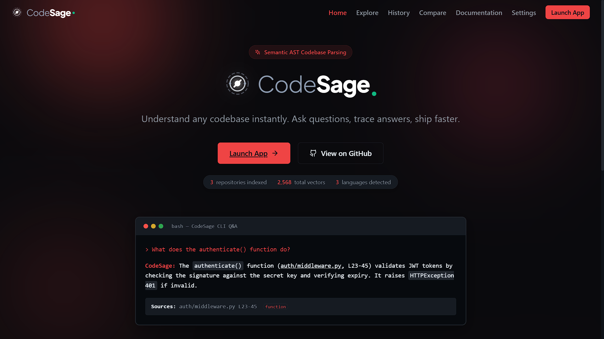
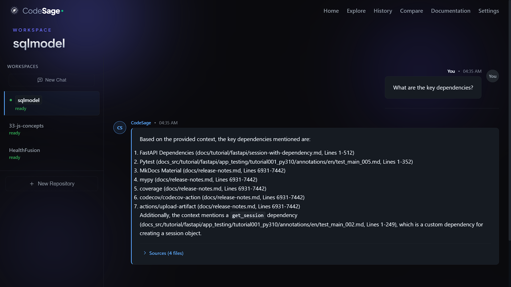
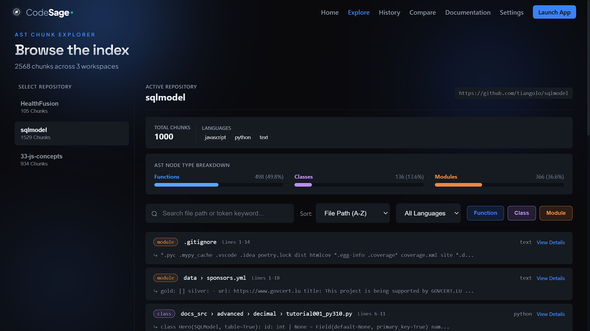
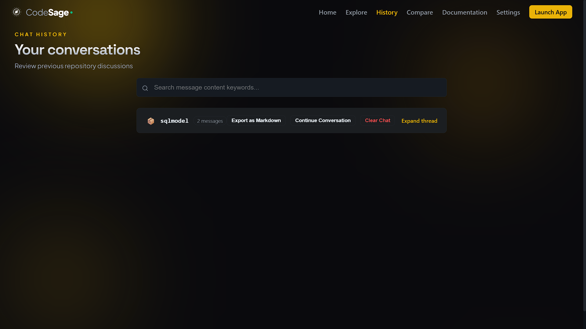
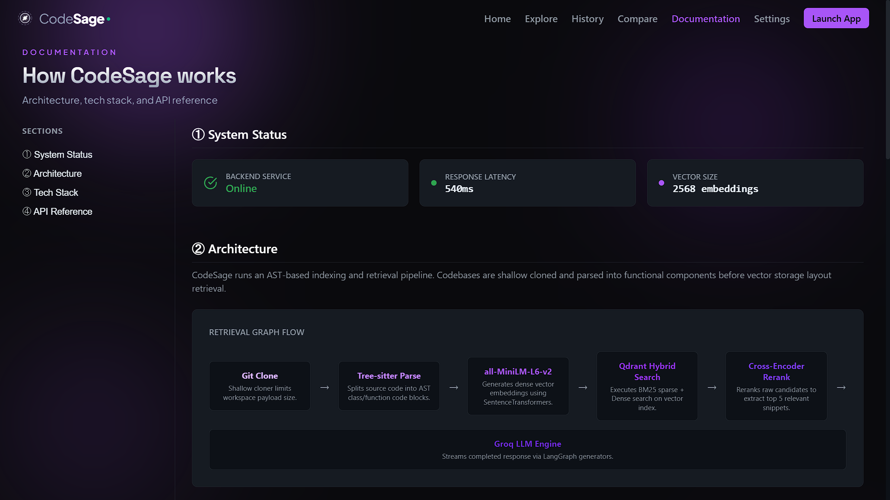
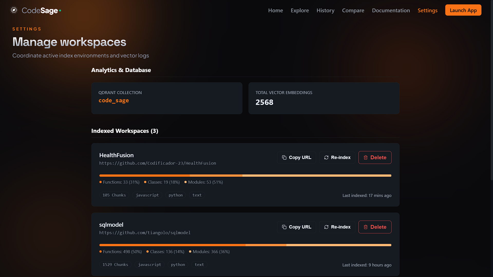

# CodeSage

**Understand any codebase instantly. Ask questions, trace answers, ship faster.**

CodeSage is a production-grade RAG (Retrieval-Augmented Generation) application that indexes GitHub repositories and answers natural-language questions about their code — every answer cites the exact file and line range it came from.

🔗 **Live demo:** [code-sage-snowy.vercel.app](https://code-sage-snowy.vercel.app)
📦 **Repository:** [github.com/Codificador-23/CodeSage](https://github.com/Codificador-23/CodeSage)



---

## What It Does

Paste a public GitHub repo URL, and CodeSage:

1. Shallow-clones the repository
2. Parses it with **Tree-sitter** into AST-aware chunks (functions, classes, modules — not arbitrary character splits)
3. Embeds every chunk with a local sentence-transformer model
4. Runs **hybrid search** (dense vector + BM25 sparse) merged with Reciprocal Rank Fusion
5. Reranks candidates with a **cross-encoder**
6. Streams a grounded answer from an LLM, with a **Reasoning Trace** showing exactly which files and line ranges the answer is based on

## Why It's Different

Most "chat with your codebase" demos split code into fixed-size text chunks and call it a day. CodeSage doesn't:

- **Code-aware chunking** — Tree-sitter parses actual function/class boundaries per language, so a chunk is never cut mid-function
- **Real hybrid search, not just semantic search** — BM25 keyword matching catches things dense embeddings miss (like someone asking about `requirements.txt` by name), merged via RRF and refined with a filename-boost heuristic
- **Reasoning Trace on every answer** — no black-box answers; every citation is a real file path and line range, verifiable in the AST Chunk Explorer
- **An actual product, not a single page** — Landing, Chat, AST Chunk Explorer, side-by-side Repo Comparison, searchable History with date grouping and markdown export, live system Documentation, and a Settings dashboard for managing indexed workspaces

---

## Screenshots

| Chat with Reasoning Trace | AST Chunk Explorer |
|---|---|
|  |  |

| History | Documentation |
|---|---|
|  |  |

| Settings |
|---|
|  |

---

## Tech Stack

| Layer | Technology |
|---|---|
| Frontend | React (Vite), React Router, vanilla CSS |
| Backend | FastAPI |
| Code parsing | Tree-sitter (Python, JS, TS, Go, Java, Rust, C++) |
| Embeddings | `sentence-transformers/all-MiniLM-L6-v2` (local, CPU) |
| Sparse retrieval | BM25 via `fastembed` (Qdrant-native) |
| Reranking | `cross-encoder/ms-marco-MiniLM-L-6-v2` |
| Vector database | Qdrant Cloud (hybrid dense + sparse collection) |
| Relational database | PostgreSQL (Neon) |
| LLM | Groq (`llama-3.3-70b-versatile`), streamed via LangChain/LangGraph |
| Backend hosting | Hugging Face Spaces (Docker) |
| Frontend hosting | Vercel |

**Why Hugging Face Spaces for the backend?** The local ML stack (PyTorch, sentence-transformers, cross-encoder) needs more memory than typical free-tier PaaS platforms allow. Render and Railway's free tiers cap out at 512MB, which isn't enough headroom for full-quality embedding + reranking on larger repositories. Rather than compromise retrieval quality or pay for hosting, CodeSage runs on Hugging Face Spaces' CPU tier, which is purpose-built for ML workloads.

---

## Architecture

```
GitHub Repo URL
      │
      ▼
 Shallow Clone (GitPython)
      │
      ▼
 Tree-sitter Parse (AST-aware chunking)
      │
      ▼
 Dense Embedding (MiniLM) + Sparse Embedding (BM25)
      │
      ▼
 Qdrant Hybrid Collection (upsert)


 User Question
      │
      ▼
 Dense Search + Sparse Search → RRF Merge → Filename-boost → Cross-Encoder Rerank
      │
      ▼
 Top-K Chunks → Groq LLM (streamed) → Answer + Reasoning Trace
```

---

## Features

- **Chat** — streamed, markdown-rendered answers with inline code, collapsible source citations, recent-question chips, keyboard shortcuts
- **AST Chunk Explorer** — browse every indexed chunk across all repos, filter by language/type, full-text search, node-type breakdown chart
- **Compare** — ask one question, get simultaneous answers from two different indexed repositories side by side
- **History** — every conversation grouped by date, searchable, exportable to Markdown, deletable per-repo
- **Documentation** — live backend health check, architecture diagram, full API reference
- **Settings** — per-repo chunk/language breakdown, re-index, delete, danger-zone full reset

---

## Evaluation

Retrieval and generation quality were evaluated with [RAGAS](https://github.com/explodinggym/ragas) against the live production deployment, using real questions run through the actual `/api/chat` endpoint (not synthetic/mocked data). Scores below are averaged across multiple live evaluation runs against the `sqlmodel` repository:

| Metric | Score |
|---|---|
| Faithfulness | ~0.85 |
| Answer Relevancy | ~0.85 |
| Context Precision | ~0.68 |

*(Averaged from several live evaluation runs rather than a single pass — Groq's free-tier daily token quota made it difficult to complete every metric in one uninterrupted run, so scores were aggregated across successful evaluations over multiple sessions.)*

---

## Known Limitations

This project is deployed entirely on free-tier infrastructure, by choice, without compromising retrieval quality (no shortcuts on chunking, embedding, or reranking). That tradeoff has two honest consequences:

- **Response times**: ~5–10 seconds for chat, ~1–2+ minutes for indexing depending on repo size — the cost of running full hybrid search + reranking on free-tier CPU rather than paid, faster hardware
- **Very large repositories** (1000+ files) may take a long time to index on the first pass

---

## Running Locally

**Backend:**
```bash
cd backend
python -m venv venv
venv\Scripts\activate       # Windows
pip install -r requirements.txt
# create a .env file with QDRANT_URL, QDRANT_API_KEY, GROQ_API_KEY, DATABASE_URL, FRONTEND_URL
uvicorn main:app --reload
```

**Frontend:**
```bash
cd frontend
npm install
npm run dev
```

---

## License

MIT
